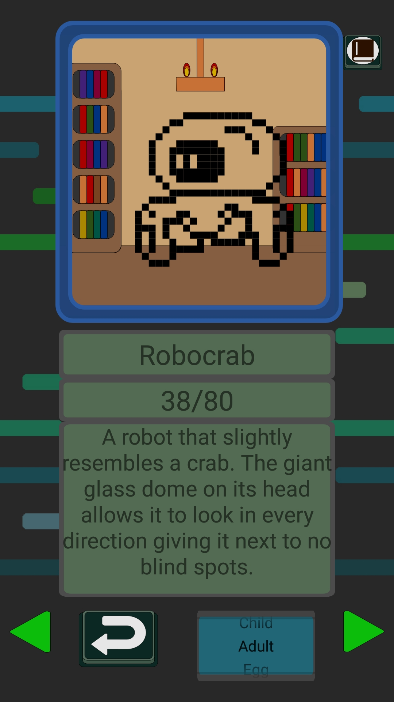

# Monster Journey

Monster Journey is a pedometer styled adventure app. Raise a monster as you take steps, train it, and play minigames to progress further as well.

This app uses the device accelerometer to track steps or movements and then adds those steps to a device database run with Room.

There are 6 basic monster types and 3 rare types to collect. Each monster will grow differently depending on how it is raised.

Sample images:

